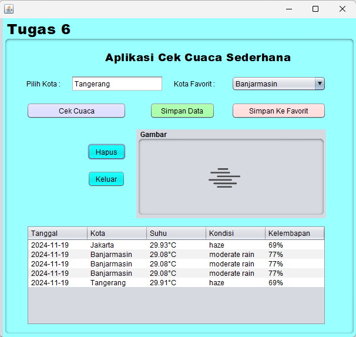

# Aplikasi Cek Cuaca Sederhana
 
Aplikasi Cek Cuaca Sederhana adalah aplikasi Java yang memungkinkan pengguna untuk memeriksa cuaca terkini di berbagai kota menggunakan data dari API OpenWeatherMap. Pengguna dapat memasukkan nama kota, melihat informasi cuaca seperti deskripsi cuaca, suhu, dan ikon cuaca, serta menyimpan dan memuat data cuaca favorit ke dalam file.

# Keunggulan Aplikasi

- *Menghitung Umur*: Aplikasi ini menghitung umur pengguna dari tanggal lahir yang diinput.
- *Tanggal Ulang Tahun Berikutnya*: Menampilkan tanggal ulang tahun berikutnya beserta hari dalam Bahasa Indonesia.
- *Peristiwa Penting*: Menampilkan peristiwa penting yang terjadi pada tanggal ulang tahun berikutnya berdasarkan data yang diambil secara daring.

# Pembuat Aplikasi
Tugas 6 - Muthya Adylla - 2210010476 - 5C Reg Pagi Bjm

# Fitur

Aplikasi ini menawarkan beberapa fitur utama:

1. Mengambil data cuaca terkini berdasarkan nama kota
2. Menampilkan deskripsi cuaca dan suhu dalam satuan Celsius
3. Menampilkan ikon cuaca berdasarkan kondisi cuaca
4. Menyimpan data cuaca yang diperoleh ke dalam file teks
5. Memuat data cuaca dari file yang sudah disimpan sebelumnya
6. Menambahkan kota favorit ke dalam daftar kota yang sering digunakan
7. Antarmuka pengguna yang sederhana dan interaktif

*Komponen Utama*
JFrame, JPanel, JLabel, JTextField, JComboBox, JButton untuk membuat antarmuka pengguna yang interaktif.
ItemListener pada ComboBox untuk memilih kota favorit dan menampilkan cuaca.
ActionListener pada tombol untuk mengambil data cuaca dan menyimpan/memuat data.
Menggunakan HttpURLConnection untuk mengambil data dari API OpenWeatherMap.
Penanganan IOException dan JSONException untuk menangani kesalahan saat mengambil data cuaca atau memproses file.

## Cara Menjalankan

1. Masukkan nama kota pada kolom teks "MASUKAN LOKASI".
2. Klik tombol "CEK CUACA" untuk mendapatkan informasi cuaca terkini untuk kota tersebut.
3. Pilih kota dari daftar kota favorit pada "PILIH LOKASI FAVORIT" untuk melihat cuaca favorit yang telah disimpan.
4. Klik tombol "TAMBAH KE FAVORIT" untuk menambahkan kota yang dipilih ke dalam daftar kota favorit.
5. Klik tombol "SIMPAN" untuk menyimpan data cuaca yang ditampilkan ke dalam file teks.
6. Klik tombol "MUAT DATA" untuk memuat data cuaca dari file yang telah disimpan sebelumnya.
7. Klik tombol "HAPUS" untuk menghapus data cuaca yang ada di tabel.
9. Klik tombol "KELUAR" untuk menutup aplikasi.

# Demo

